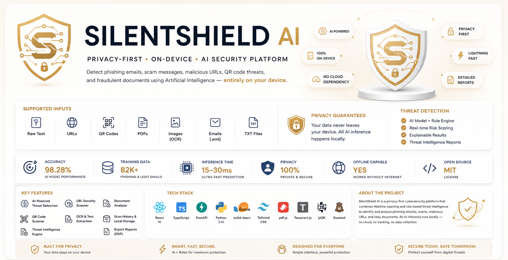
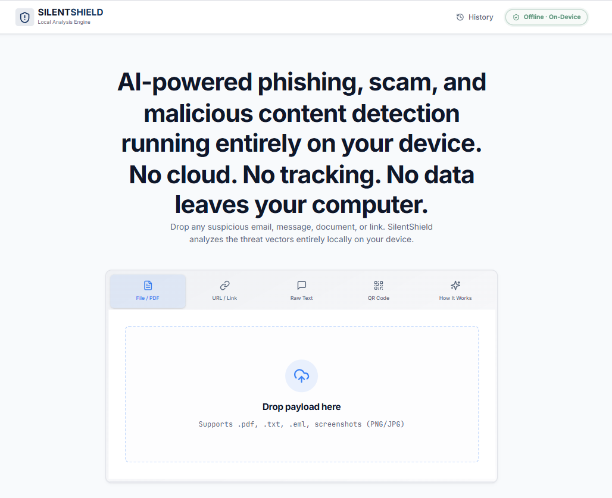
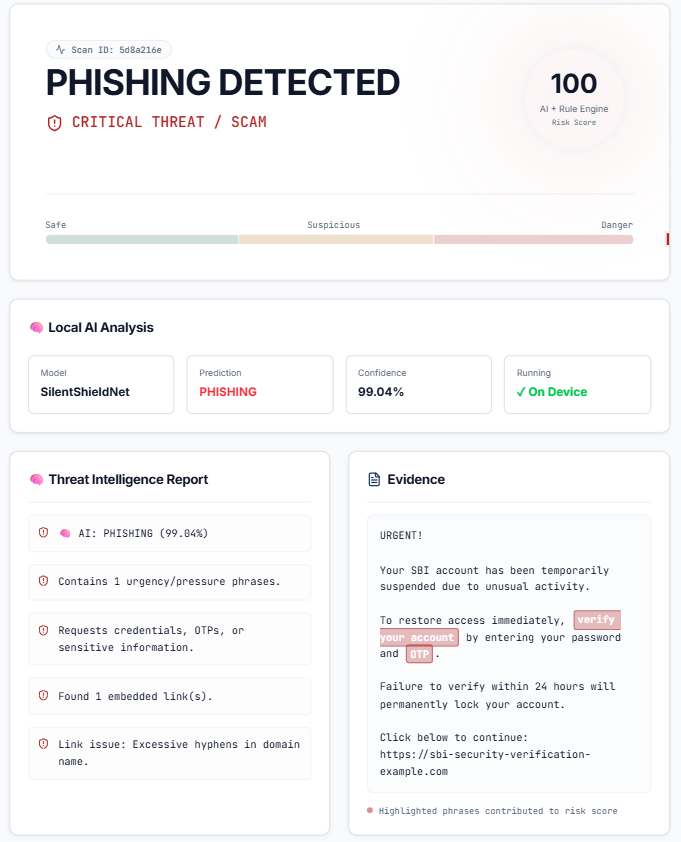
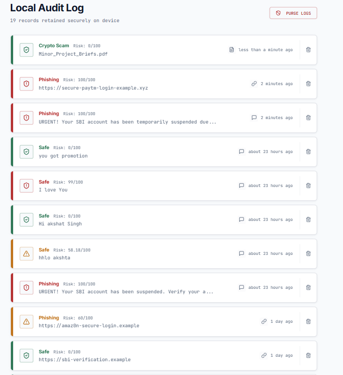
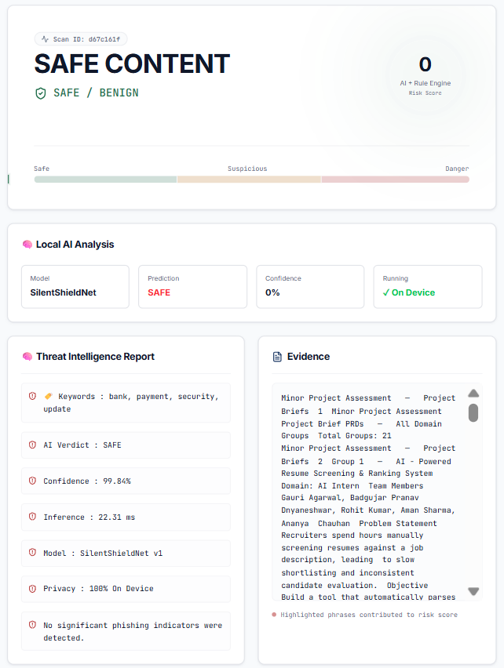
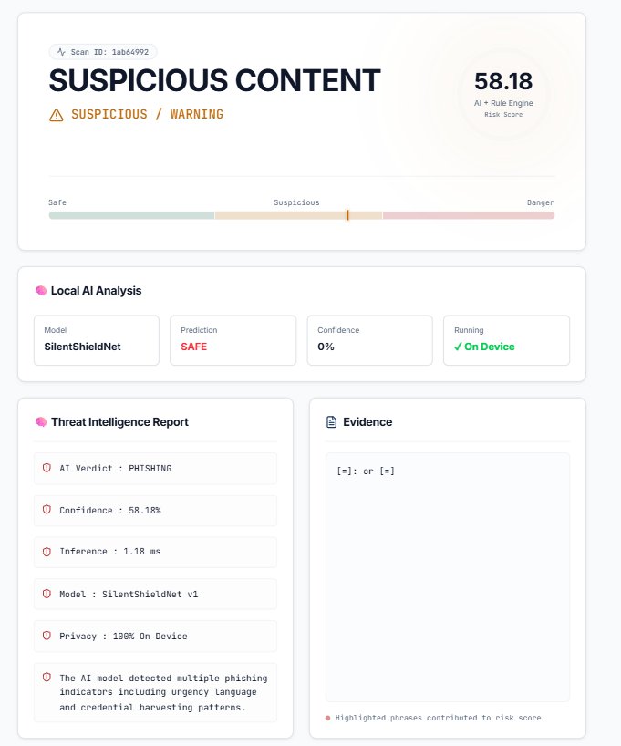

<div align="center">



# 🛡️ SilentShield AI

### 🔒 Privacy-First On-Device AI Security Platform

**Detect phishing emails, scam messages, malicious URLs, QR code threats, and fraudulent documents using Artificial Intelligence — entirely on your device.**

No Cloud · No Tracking · No Data Collection · 100% Local AI

<br>


<br>


<br><br>

[**Features**](#-key-features) · [**Screenshots**](#-screenshots) · [**Architecture**](#️-system-architecture) · [**Installation**](#-installation) · [**API**](#-api-documentation)

</div>

---

## 🎥 Demo Video

**[▶ Watch the Demo](https://www.youtube.com/watch?v=yfxX78QJcbM)**

A walkthrough of the problem, the solution, and the on-device AI component working end to end.

---

## 📋 Table of Contents

- [Demo Video](#-demo-video)
- [Overview](#-overview)
- [Why SilentShield AI?](#-why-silentshield-ai)
- [At a Glance](#-at-a-glance)
- [Key Features](#-key-features)
- [Supported Inputs & Formats](#-supported-inputs--formats)
- [Screenshots](#-screenshots)
- [System Architecture](#️-system-architecture)
- [Detection Pipeline](#️-detection-pipeline)
- [AI Model](#-ai-model)
- [Technology Stack](#️-technology-stack)
- [Project Structure](#-project-structure)
- [Installation](#-installation)
- [API Documentation](#-api-documentation)
- [Model Performance](#-model-performance)
- [Threat Detection Capabilities](#-threat-detection-capabilities)
- [Privacy & Security](#-privacy--security)
- [Real-World Applications](#-real-world-applications)
- [Hackathon Alignment](#-hackathon-alignment)
- [Learning Outcomes](#-learning-outcomes)
- [Project Goals](#-project-goals)
- [Future Roadmap](#-future-roadmap)
- [Contributing](#-contributing)
- [Reporting Issues](#-reporting-issues)
- [Acknowledgements](#-acknowledgements)
- [Contact](#-contact)
- [Support](#-support)
- [License](#-license)

---

## 🌟 Overview

**SilentShield AI** is a privacy-first cybersecurity platform that combines **Machine Learning** and **rule-based threat intelligence** to identify phishing attacks, scams, malicious URLs, QR code traps, and suspicious documents.

Unlike traditional cloud-based security tools, SilentShield performs **all AI inference locally** using a custom Machine Learning model. No sensitive information is transmitted to external servers, ensuring complete privacy and low-latency analysis.

The project was developed as an **On-Device AI** solution, demonstrating how intelligent cybersecurity systems can operate entirely on a user's machine without relying on cloud AI services.

---

## 🚀 Why SilentShield AI?

Modern phishing attacks continue to evolve rapidly. Attackers now use AI-generated phishing emails, fake banking websites, QR-code phishing, credential harvesting, fake payment requests, social engineering, and cryptocurrency scams.

Most existing security platforms require users to upload their data to cloud servers before analysis. SilentShield solves this by bringing AI directly onto the user's device — the result is complete privacy, offline detection, faster analysis, and zero cloud dependency.

SilentShield is more than a phishing detector — it demonstrates how modern cybersecurity can leverage lightweight Machine Learning while respecting user privacy, combining AI, web security, privacy engineering, and human-centered design into one platform.

---

## ✅ At a Glance

<div align="center">

| | | |
|---|---|---|
| ✔️ Privacy-First Architecture | ✔️ 100% Local AI Inference | ✔️ Hybrid Detection Engine |
| ✔️ Custom Machine Learning Model | ✔️ Explainable AI | ✔️ Threat Intelligence Reports |
| ✔️ Report Export | ✔️ Scan History | ✔️ Browser-Based OCR |
| ✔️ PDF Parsing | ✔️ QR Detection | ✔️ URL Intelligence |

</div>

---

## ✨ Key Features

### 🤖 AI Threat Detection
- Custom Machine Learning phishing detection model
- Local inference using FastAPI
- AI confidence scoring
- Threat explanation and keyword extraction
- Hybrid AI + Rule Engine

### 📄 Document Scanner
Analyzes PDF documents, TXT files, email files (`.eml`), screenshots, and OCR images — all text extraction happens locally before AI analysis.

### 🌐 URL Security Scanner
Detects suspicious URLs, fake banking websites, typosquatting attacks, dangerous top-level domains, and embedded phishing links.

### 📱 QR Code Scanner
Safely decodes QR codes without opening them, detecting hidden phishing URLs, fake login pages, and suspicious redirects.

### 🧠 Threat Intelligence Engine
Combines Machine Learning prediction, rule-based detection, URL heuristics, credential-harvesting patterns, urgency-language detection, and risk scoring.

### 📊 AI Analysis Dashboard
Displays AI prediction, confidence score, risk score, threat category, evidence, triggered rules, highlighted content, and a full threat report.

### 📂 Scan History
Every scan is stored locally inside browser storage — no cloud database required.

### 📤 Export Report
Generate professional security reports for investigation, documentation, and incident reporting.

### 🔒 Privacy First
No OpenAI, no Gemini, no cloud AI, no external API — everything runs locally.

---

## 🎯 Supported Inputs & Formats

| Type | Supported |
|------|-----------|
| Raw Text | ✅ |
| URLs | ✅ |
| PDF Files | ✅ |
| TXT Files | ✅ |
| EML Emails | ✅ |
| Images (PNG/JPG/JPEG) | ✅ |
| QR Codes | ✅ |

---

## 📸 Screenshots

<div align="center">

**🏠 Home Dashboard**


*Unified interface for scanning text, URLs, QR codes, PDFs, emails, and images.*

<br><br>

**🧠 AI Threat Analysis**


*AI prediction, confidence score, risk score, threat intelligence report, highlighted evidence, and rule engine results.*

<br><br>

**📂 Scan History**


*Every completed scan stored locally in the browser — revisit previous reports anytime.*

<br><br>

**📄 PDF Analysis**


*Extracts text directly inside the browser before running AI analysis.*

<br><br>

**📱 QR Code Scanner**


*Safely decodes QR codes without opening unknown links.*

</div>

---

## 🏗️ System Architecture

```text
                        User Input
                             │
        ┌────────────────────┼────────────────────┐
        │                    │                    │
        ▼                    ▼                    ▼
    Raw Text              URL Scanner         File Scanner
                                                │
                           ┌────────────────────┴────────────────────┐
                           │                                         │
                           ▼                                         ▼
                     PDF Parser                               OCR Engine
                     (pdf.js)                             (Tesseract.js)
                           │                                         │
                           └────────────────────┬────────────────────┘
                                                ▼
                                       Extracted Text
                                                │
                              ┌─────────────────┴──────────────────┐
                              │                                    │
                              ▼                                    ▼
                      Rule-Based Analysis                  AI Classification
                                                          (FastAPI Backend)
                              │                                    │
                              └─────────────────┬──────────────────┘
                                                ▼
                                    Threat Intelligence Engine
                                                │
                                                ▼
                                      Risk Assessment Report
                                                │
                                                ▼
                                     Local History & Export
```

---

## ⚙️ Detection Pipeline

SilentShield AI follows a hybrid cybersecurity pipeline designed for privacy, speed, and accuracy.

**Step 1 — Input Collection:** the user submits an email, SMS, URL, PDF, QR code, image, or plain text.

**Step 2 — Data Extraction:** SilentShield extracts text locally, depending on input type:

| Input | Extraction Method |
|--------|-------------------|
| PDF | pdf.js |
| Image | OCR (Tesseract.js) |
| QR | jsQR |
| Text | Direct |
| URL | URL Parser |

No files are uploaded to external servers at any stage.

**Step 3 — AI Threat Classification:** extracted content is sent to the local FastAPI backend, which performs text vectorization (TF-IDF), ML prediction, confidence calculation, and threat classification — returning a prediction, confidence, threat level, keywords, and explanation.

**Step 4 — Rule Engine:** simultaneously checks credential-theft language, urgency phrases, banking keywords, dangerous TLDs, suspicious URLs, and fake login attempts, producing a second independent security score.

**Step 5 — Threat Fusion:** the ML result and rule-engine result are combined into a risk score, severity, threat category, highlighted evidence, detection rules, and AI explanation.

**Step 6 — Report Generation:** the user receives a threat intelligence report with evidence, highlighted indicators, AI prediction, and an exportable report.

---

## 🤖 AI Model

SilentShield uses a custom phishing detection model trained specifically for cybersecurity analysis.

| Property | Value |
|-----------|-------|
| Model | SilentShieldNet v1 |
| Algorithm | TF-IDF + Logistic Regression |
| Framework | Scikit-Learn |
| Backend | FastAPI |
| Language | Python |
| Inference | Local |
| Cloud | None |

**AI capabilities** — the model identifies credential harvesting, banking scams, urgency attacks, password requests, OTP theft, fake invoices, cryptocurrency scams, fake login pages, and payment fraud.

---

## 🛠️ Technology Stack

<div align="center">


</div>

| Category | Technologies |
|---|---|
| **Frontend** | React 19, TypeScript, Vite, Tailwind CSS, Wouter, Zustand, React Query |
| **Backend** | FastAPI, Python, Scikit-Learn, Joblib, Uvicorn |
| **Machine Learning** | Logistic Regression, TF-IDF Vectorizer, Scikit-Learn Pipeline |
| **Document Processing** | pdf.js, Tesseract.js, jsQR |
| **State Management** | Zustand |
| **Styling** | Tailwind CSS, Lucide Icons |

---

## 📁 Project Structure

```
SilentShield-AI/
│
├── backend/
│   ├── app.py
│   ├── phishing_model.pkl
│   └── requirements.txt
│
├── ml/
│   ├── train.py
│   ├── export_onnx.py
│   ├── inspect_model.py
│   └── requirements.txt
│
├── public/
│   └── models/
│
├── src/
│   ├── components/
│   ├── hooks/
│   ├── pages/
│   ├── services/
│   ├── store/
│   ├── App.tsx
│   └── main.tsx
│
├── package.json
├── vite.config.ts
└── README.md
```

---

## ⚙️ Installation

### Prerequisites

| Software | Version |
|----------|----------|
| Node.js | 18+ |
| npm | Latest |
| Python | 3.10+ |
| Git | Latest |

### Clone the Repository

```bash
git clone https://github.com/akshatsingh1427/SilentShield-AI.git
cd SilentShield-AI
```

### Frontend Setup

```bash
npm install
npm run dev
```

Frontend runs at **http://localhost:5173**

### Backend Setup

```bash
cd backend
pip install -r requirements.txt
python -m uvicorn app:app --reload
```

Backend runs at **http://127.0.0.1:8000**

### Running SilentShield AI

Start both services in separate terminals:

```bash
# Terminal 1
npm run dev

# Terminal 2
cd backend
python -m uvicorn app:app --reload
```

Then open **http://localhost:5173** — the application is now fully operational.

### Training the AI Model

```bash
cd ml
pip install -r requirements.txt
python train.py
```

This generates `phishing_model.pkl`, which is automatically loaded by the FastAPI backend.

---

## 📡 API Documentation

### Health Check

**Request:** `GET /`

**Response:**

```json
{
  "message": "SilentShield AI Running",
  "status": "OK",
  "model": "SilentShieldNet v1"
}
```

### Predict Endpoint

**Request:** `POST /predict`

**Body:**

```json
{
    "text": "Your SBI account has been suspended. Verify immediately."
}
```

**Response:**

```json
{
    "prediction": "PHISHING",
    "confidence": 98.97,
    "risk_level": "HIGH",
    "inference_time_ms": 18.4,
    "model": "SilentShieldNet v1",
    "algorithm": "TF-IDF + Logistic Regression",
    "dataset": "82K+ Phishing & Legitimate Emails",
    "privacy": "100% On Device",
    "keywords": ["verify", "account"],
    "explanation": "The AI model detected multiple phishing indicators including urgency language and credential harvesting patterns."
}
```

---

## 🧪 Model Performance

| Metric | Score |
|---------|-------|
| Accuracy | 98.28% |
| Precision | 98% |
| Recall | 98% |
| F1 Score | 98% |

The model was trained using a TF-IDF feature extractor combined with Logistic Regression for lightweight, explainable, and efficient local inference.

**Local AI inference:** average response time of **15–30 ms**, depending on hardware.

---

## 🔍 Threat Detection Capabilities

SilentShield AI identifies credential harvesting, banking scams, fake login pages, fake payment requests, malicious URLs, QR phishing, invoice fraud, crypto scams, OTP theft, password theft, social engineering, typosquatting, urgency language, and fake security alerts.

---

## 🔐 Privacy & Security

SilentShield AI was designed around a Privacy-by-Design architecture.

| Question | Answer |
|---|---|
| Internet connection required? | No |
| Cloud AI used? | No |
| User data stored externally? | No |
| Third-party APIs used? | No |
| AI runs locally? | Yes |

The application never uploads user files, PDFs, screenshots, emails, or URLs, and never stores personal information externally. Every analysis is performed locally on the user's machine — making SilentShield suitable for privacy-sensitive environments where cloud-based security solutions aren't acceptable.

**Why on-device AI?** Traditional AI security tools send sensitive user information to cloud servers. SilentShield's local-first approach means lower latency, better privacy, offline capability, no API costs, no internet dependency, and full user control.

---

## 🌍 Real-World Applications

| Domain | Use Case |
|---|---|
| **🏦 Banking** | Protect customers from fake banking websites, credential harvesting, payment fraud, and QR payment scams |
| **🏢 Enterprise Security** | Analyze suspicious emails, internal phishing attempts, malicious attachments, and fake login portals |
| **🎓 Education** | Teach cyber awareness, phishing detection, social engineering, and safe browsing |
| **👨‍💻 Individual Users** | Detect WhatsApp scams, SMS scams, fake giveaways, crypto fraud, and email phishing |

---

## 🏅 Hackathon Alignment

This project was built for an **On-Device AI** theme, satisfying its core objectives:

- ✅ **Local AI Inference** — the phishing detection model executes entirely on the user's machine
- ✅ **Offline First** — core AI functionality works without relying on cloud AI services
- ✅ **Privacy Focused** — sensitive user content remains on the local device
- ✅ **Open Source** — the entire project is available for inspection, learning, and contribution

---

## 🎓 Learning Outcomes

Building SilentShield AI provided hands-on experience in:

- Machine Learning deployment and model training
- FastAPI development
- React + TypeScript
- OCR and PDF processing
- QR code analysis
- Browser APIs
- Cybersecurity fundamentals
- Explainable AI
- Privacy engineering

---

## 🎯 Project Goals

SilentShield AI was built with four primary goals:

- **🔒 Privacy** — ensure sensitive user information never leaves the user's device
- **⚡ Performance** — provide fast local AI inference without relying on cloud services
- **🛡️ Security** — detect modern phishing attacks using Machine Learning and rule-based analysis
- **🌍 Accessibility** — create an easy-to-use cybersecurity tool for everyone

---

## 📈 Future Roadmap

**AI**
- [ ] Transformer-based phishing detection
- [ ] Local LLM integration
- [ ] Explainable AI (XAI) enhancements
- [ ] Federated learning

**Security**
- [ ] Browser extension
- [ ] Email client integration
- [ ] Mobile application
- [ ] Real-time URL monitoring
- [ ] File reputation database

**User Experience**
- [ ] Dashboard analytics
- [ ] Team workspace
- [ ] Threat timeline and trends

**Long-term vision:** SilentShield AI aims to evolve into a comprehensive on-device cybersecurity assistant — covering browser protection, email security, mobile security, enterprise deployment, an offline AI assistant, real-time monitoring, explainable AI dashboards, and local LLM-powered investigations.

---

## 🤝 Contributing

Contributions are welcome! If you'd like to improve SilentShield AI, feel free to fork the repository and submit a Pull Request.

```bash
# 1. Fork the repository

# 2. Create your feature branch
git checkout -b feature/amazing-feature

# 3. Commit your changes
git commit -m "Add amazing feature"

# 4. Push to the branch
git push origin feature/amazing-feature

# 5. Open a Pull Request
```

---

## 🐞 Reporting Issues

If you discover a bug or have a feature request, please open a GitHub Issue including:

- Problem description
- Steps to reproduce
- Expected behavior
- Screenshots (if applicable)

---

## 🙏 Acknowledgements

Special thanks to the open-source community behind the tools this project is built on:

| Category | Tools |
|---|---|
| **Frontend** | React, Vite, Tailwind CSS, Wouter, Zustand |
| **Backend** | FastAPI, Scikit-Learn, Joblib, Uvicorn |
| **AI & ML** | Scikit-Learn, TF-IDF, Logistic Regression |
| **Browser Processing** | Tesseract.js, pdf.js, jsQR |

---

## 📬 Contact

<div align="center">

**Akshat Singh**
B.Tech Computer Science Engineering
Data Science & Analytics Intern @ WeIntern · Technical Head @ Dice Hub, JIIT

<a href="https://github.com/akshatsingh1427">
  
</a>

</div>

---

## ⭐ Support

If you found this project useful, please consider starring the repository, forking the project, contributing improvements, or sharing it with others. Your support helps improve the project and encourages future open-source development.

---

## 📜 License

This project is licensed under the [MIT License](LICENSE) — you're free to use, modify, and distribute it with proper attribution.

---

<div align="center">

# 🛡️ SilentShield AI

### Privacy-First · On-Device · AI-Powered Cybersecurity

**Protecting users from phishing and digital fraud while keeping their data exactly where it belongs — on their own device.**

⭐ If you like this project, don't forget to star the repository!

Made with ❤️ by **Akshat Singh**

</div>
